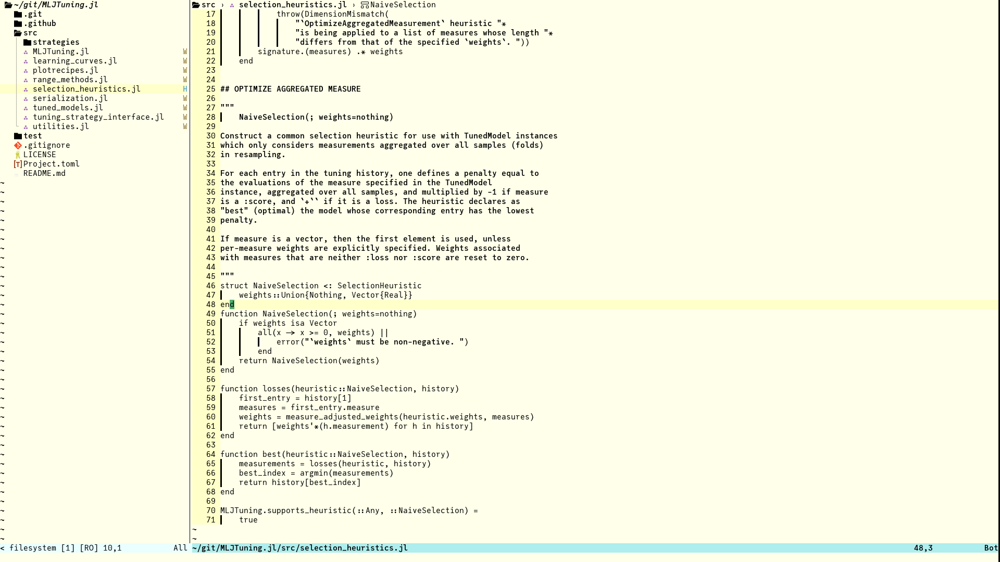

# dookie.nvim
A color scheme inspired by Plan9's acme editor, but with a personal touch.



> [!WARNING]
> This project is in its early stages. Some highlight groups may be missing.

# Requirements
- Neovim 0.8 or higher

# Installation
This is the installation using [lazy.nvim](https://github.com/folke/lazy.nvim), but you can use any plugin manager you like.
```lua
{
    "pebeto/dookie.nvim",
    config = function()
    vim.cmd.colorscheme("dookie")
    end,
}
```

# Contributing
If you find something missing or have a suggestion, feel free to open an issue or a pull request.
